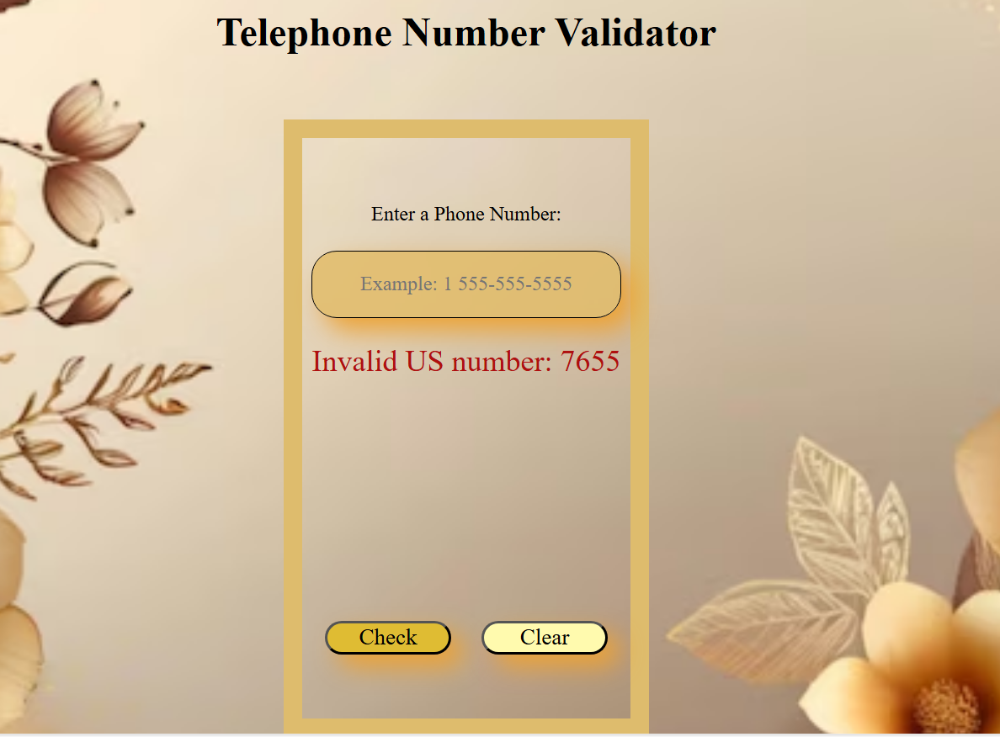

# Telephone validation number 🚀
 
## Project Description 📝

> That is a Telephone validation number . that have sections, contaian all the article, which containe all the div, button, input tages and a background picture. have related sections, then we use id selector to reference the specific section to specific function. This web pages is fully responsive we use @media query that adjust our page in every screen size. this is the main feature of this webpage and it has a greate design. 
>

## Demo 📸

life demo link []

how it looks in desktop screen




## Technologies Used 🛠️

List the technologies or tools that i used to develop this project. 
- HTML
- CSS
- JAVASCRIPT


## Installation 💻

for using this project you neet to install 3 things:

- update version of chrome
- an IDE like vscode
- git bash
- account in github


## Usage 🎯

for using this project you need to know a few commond first clone the repositry in yor local machine then go to the github directory . open the project on your IDE like vscode and start working on it .


go to the cmd and clone the Technical Documentation Page 
using this commond:
```bash

git clone git@github.com:sodabarauf/telephone-number-validator.git
```
go to the terminal (git bash):
```bash

cd>telephone-validator-number

```
open the project on your IDE like vscode :

```bash

cd>code .

```


## Features ⭐
- Responsive webpage


## Sodaba Rauf 👩‍💻


- LinkedIn: [(https://www.linkedin.com/in/sodaba-r/)]
- Email: [(sodabarauf4@gmail.com)]

## Contributing 🤝
For contribution you can create a pull request

